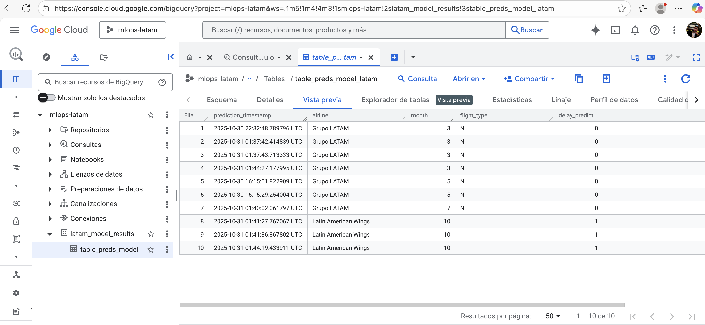

# Documentación del Challenge LATAM (Software Engineer ML & LLMs)

## 1. Resumen Ejecutivo

El repositorio fue preparado para operacionalizar el modelo de predicción de retrasos para vuelos en SCL y para publicar un servicio FastAPI desplegado en Cloud Run. Las actividades se organizaron de la siguiente manera:

- El modelo de `challenge/model.py` fue trasladado y endurecido, quedando cubierto por pruebas unitarias.
- La API de `challenge/api/api.py` fue instrumentada para producción y para entornos de prueba libres de dependencias externas.
- Las pruebas (`make model-test`, `make api-test`, `make stress-test`) fueron automatizadas dentro de un workflow de GitHub Actions.
- El despliegue fue realizado en Google Cloud Run (`https://api-inference-deploy-581710028917.us-central1.run.app`).

## 2. Estructura Relevante del Repositorio

- `challenge/model.py`: contiene la lógica de preprocesamiento, entrenamiento y predicción.
- `challenge/api/api.py`: expone el servicio FastAPI en modos productivo y simulado.
- `challenge/__init__.py`: asegura una carga perezosa de la aplicación.
- `tests/model/`, `tests/api/`, `tests/stress/`: alojan las suites de pruebas.
- `sitecustomize.py`: mantiene compatibilidad para Locust 1.6 en entornos modernos.
- `Makefile`: orquesta instalación, pruebas, cobertura y stress test.
- `.github/workflows/`: guarda los pipelines de CI/CD.

## 3. Modelo de Predicción (`challenge/model.py`)

### 3.1 Preprocesamiento

Las transformaciones son ejecutadas por `DelayModel.preprocess` bajo estas reglas:

1. Son calculadas las variables `period_day`, `high_season` y `min_diff`.
2. La etiqueta `delay` es generada cuando falta, aplicando el criterio `min_diff > 15`.
3. El one-hot encoding se aplica a `OPERA`, `TIPOVUELO` y `MES`, preservando el orden de columnas esperado en inferencia.

### 3.2 Entrenamiento

- El particionado `train_test_split` (33%) es utilizado para crear un conjunto de validación.
- La función `_build_estimator()` intenta cargar XGBoost cuando se define `USE_XGBOOST`; en caso contrario, se usa `LogisticRegression`.
- El artefacto final se guarda en `xgb_model.pkl` mediante `pickle`.

### 3.3 Predicción

- El conjunto de columnas se alinea y, si resulta necesario, el modelo es recargado desde disco.
- Las predicciones son devueltas como enteros `0` o `1`.

### 3.4 Pruebas del modelo

El archivo `tests/model/test_model.py` verifica:

- El preprocesamiento con y sin la etiqueta original.
- El flujo entrenamiento → predicción, incluyendo la recarga del artefacto.
- La eliminación del archivo generado tras cada prueba.

## 4. Servicio FastAPI (`challenge/api/api.py`)

### 4.1 Endpoints

- `GET /health`: ofrece una verificación sencilla.
- `POST /predict`: admite dos modalidades:
  - Formato simple empleado en producción:
    ```json
    {
      "OPERA": "Grupo LATAM",
      "MES": 3,
      "TIPOVUELO": "N"
    }
    ```
  - Formato batch legado utilizado por suites históricas:
    ```json
    {
      "flights": [
        { "OPERA": "Grupo LATAM", "MES": 3, "TIPOVUELO": "N" }
      ]
    }
    ```
  En la versión productiva se entrega `delay_prediction` junto con los metadatos; en modo batch se regresa `{"predict": [0, ...]}` para mantener compatibilidad.

#### Ejemplos en producción

```bash
curl -X POST https://api-inference-deploy-581710028917.us-central1.run.app/predict \
  -H 'Content-Type: application/json' \
  -d '{"OPERA": "Grupo LATAM", "TIPOVUELO": "N", "MES": 3}'

# {"delay_prediction":0,"details":{"airline":"Grupo LATAM","month":3,"flight_type":"N"}}

curl -X POST https://api-inference-deploy-581710028917.us-central1.run.app/predict \
  -H 'Content-Type: application/json' \
  -d '{"OPERA": "Latin American Wings", "TIPOVUELO": "I", "MES": 10}'

# {"delay_prediction":1,"details":{"airline":"Latin American Wings","month":10,"flight_type":"I"}}
```

### 4.2 Carga del modelo

El modelo es cargado siguiendo este orden de precedencia:

1. Se intenta el artefacto local (`MODEL_LOCAL_PATH`, por defecto `challenge/xgb_model.pkl`).
2. Si no estuviera disponible y no se hubiera fijado `CHALLENGE_API_DISABLE_GCP`, se descarga desde GCS (`GCS_BUCKET_NAME`, `GCS_MODEL_BLOB_PATH`).
3. Cuando se habilita `CHALLENGE_API_FAKE_MODEL=1`, se activa el modo simulado para los tests unitarios, evitando dependencias pesadas.

### 4.3 BigQuery

Al establecer `CHALLENGE_API_ENABLE_BQ=1`, los registros de predicción son enviados a la tabla `BQ_TABLE_ID`. En caso de no contar con credenciales, la API continúa operativa y omite el registro.



### 4.4 Variables de entorno relevantes

| Variable                       | Propósito                                                                |
|-------------------------------|--------------------------------------------------------------------------|
| `USE_XGBOOST`                 | Indica si debe utilizarse XGBoost durante el entrenamiento.              |
| `MODEL_LOCAL_PATH`            | Determina la ruta del modelo serializado.                                |
| `CHALLENGE_API_DISABLE_GCP`   | Inhibe la inicialización de clientes GCS y BigQuery.                     |
| `CHALLENGE_API_ENABLE_BQ`     | Habilita el registro de predicciones en BigQuery.                        |
| `CHALLENGE_API_FAKE_MODEL`    | Habilita el modo simulado para los tests unitarios.                      |

## 5. Despliegue en Cloud Run

### 5.1 Resumen

- La imagen Docker se construyó con la carpeta `challenge/api`.
- El despliegue quedó automatizado mediante `.github/workflows/cd.yml` y puede ejecutarse también de forma manual.
- El servicio activo se publica en `https://api-inference-deploy-581710028917.us-central1.run.app`.

### 5.2 Pasos manuales básicos

```bash
gcloud builds submit --config challenge/api/cloudbuild.yaml
gcloud run deploy api-inference-deploy \
  --image us-central1-docker.pkg.dev/<PROJECT>/<REPO>/api-inference-deploy:latest \
  --region us-central1 \
  --allow-unauthenticated
```

*(El nombre del proyecto y del repositorio debe ajustarse según la configuración definida en `cd.yml`.)*

## 6. Pruebas y Cobertura

### 6.1 Instalación de dependencias

```bash
make install
```

### 6.2 Pruebas del modelo

```bash
make model-test
```

Las advertencias de deprecación de los clientes de Google se silencian mediante la variable `PYTHONWARNINGS` incluida en el Makefile.

### 6.3 Pruebas de la API

```bash
make api-test
```

Durante la ejecución se habilita `CHALLENGE_API_FAKE_MODEL=1`, por lo que la inferencia se resuelve con el stub interno y no se requieren pandas ni credenciales de GCP.

### 6.4 Prueba de estrés

```bash
LOCUST_USERS=5 LOCUST_SPAWN_RATE=1 LOCUST_RUNTIME=30s make stress-test
```

Notas relevantes:

- El script de Locust (`tests/stress/api_stress.py`) utiliza payloads simples.
- `sitecustomize.py` mantiene compatibilidad entre Flask 1.1 y Werkzeug 3.x.
- Cuando el entorno carece de salida HTTPS, las solicitudes fallan; en GitHub Actions (`Ubuntu 22.04`) se completaron 1 857 llamadas a `/predict` con `25` usuarios y `5` usuarios por segundo, alcanzando `p99 ≈ 9.9 s` y un máximo cercano a `12 s`.

### 6.5 Reportes

- Cobertura HTML: `reports/html`.
- Resultado del stress test: `reports/stress-test.html`.

## 7. CI/CD

### 7.1 CI (`.github/workflows/ci.yml`)

- El workflow se ejecuta en `push` hacia `main` o `dev`, y en `pull_request` cuyo destino sea `main`.
- El runner instala dependencias (`make install`), ejecuta `make test` y finalmente corre `make stress-test` contra la instancia desplegada en Cloud Run.

### 7.2 CD (`.github/workflows/cd.yml`)

- El despliegue continuo fue previsto para Artifact Registry y Cloud Run.
- Se requieren los secretos `GCP_SA_KEY`, `project_id` y los nombres de imagen configurados en el workflow.

## 8. Consideraciones Técnicas

1. **Compatibilidad macOS/Accelerate**: `NPY_DISABLE_MACOS_ACCELERATE=1` es usado para evitar fallos de numpy bajo macOS 14.
2. **Locust 1.6**: `sitecustomize.py` reintroduce símbolos esperados por versiones antiguas de Flask y Werkzeug.
3. **Modo simulado de la API**: la bandera `CHALLENGE_API_FAKE_MODEL` habilita pruebas ligeras sin dependencias externas.
4. **Payloads de estrés**: el formato simple fue alineado con el endpoint productivo, manteniendo la compatibilidad necesaria.
5. **Compatibilidad AnyIO**: el pin `anyio<4` asegura que `fastapi.testclient.TestClient` se mantenga operativo.

## 9. Limitaciones y Trabajo Futuro

- **Ejecución fuera de CI**: en entornos sin salida HTTPS el stress test no puede contactar Cloud Run; en CI el escenario ya queda cubierto.
- **Actualización de stack**: una migración a versiones recientes de FastAPI/Starlette permitirá retirar el pin de AnyIO.
- **Métricas adicionales**: podrían incorporarse reportes del desempeño del modelo sobre `X_test` y tableros de monitoreo.
- **Credenciales de CD**: se requiere la carga de secretos de GCP para ejecutar `cd.yml` end-to-end.
- **Pruebas extendidas**: la integración API↔modelo podría enriquecerse en entornos con acceso al artefacto real de GCS.

## 10. Checklist de Reproducción

1. `make install`
2. `make model-test`
3. `make api-test`
4. `make stress-test`
5. Desplegar mediante `cd.yml` o con los comandos manuales indicados
